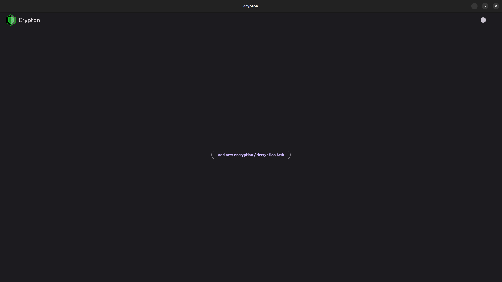
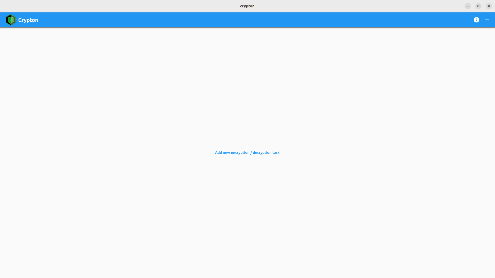

# Crypton

Crypton is a File Encryption application. Currently it can encrypt files by using AES, Salsa and Fernet algorithms.

# Download fron Snap Store (Ubuntu)

# Screenshots

|                 Screenshots                 |                                             |
| :-----------------------------------------: | :-----------------------------------------: |
|  |  |
|  |  |

If you found a bug, please [contact me](http://andre-i.eu/#contactme).
